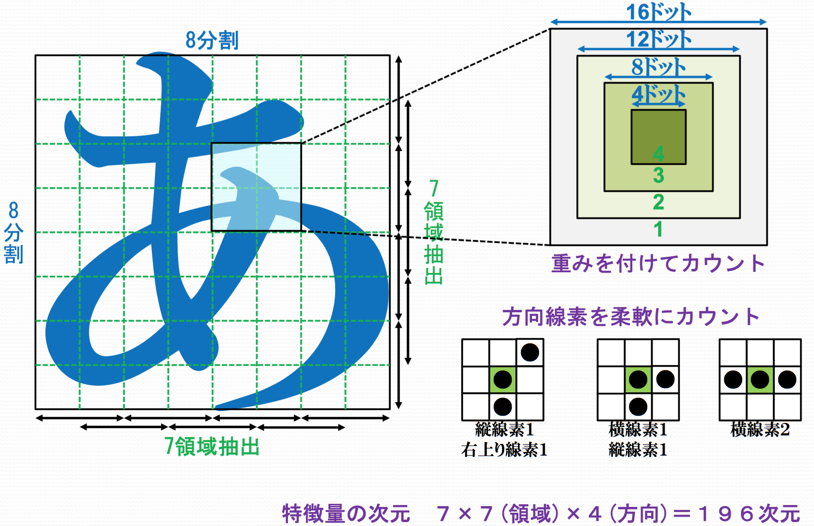
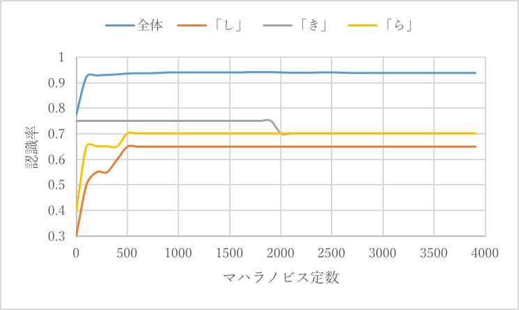

HardWriting Recognition
======================
pythonでの手書き文字認識


1. 認識アルゴリズムについて
=========================

字種ごとの平均特徴量・固有値・固有ベクトルからマハラノビス距離を算出し、認識対象文字の特徴量と各字種との間のマハラノビス距離が小さいものを認識結果とするアルゴリズムを使用した。

2. 方法と使用するデータ
=================================

データは文字を縦横8分割し、縦横共に7領域を作り、領域内の方向線素をカウントして得られた7(領域)\*7(領域)\*4(方向)=196次元の特徴量を用いた。図1に示す。


図1 特徴量の抽出方法

特徴量データはディレクトリ以下のData/に入っている。字種ごと200個分の特徴量にが01.txt\~c46.txtに格納され、それぞれ200文字分のデータのうち最初の180文字文を学習に使用し、最後の20文字を認識に使用した。

実験方法は以下の(1)\~(5)に示す。

　(1). 字種ごとの平均特徴量を計算する。

　(2). 固有値・固有ベクトルを求めるための分散・共分散行列を計算する。

　(3).
(2)で得られた分散・共分散行列から、ヤコビ法を用いて、固有値・固有ベクトルを計算する。固有値・固有ベクトルを固有値の大きい方から順に並び替える。

　(4).
字種ごとの平均特徴量・固有値・固有ベクトルを予め算出し、それらを用いて、マハラノビス距離を計算した。このとき、マハラノビス距離の計算式の定数の値は1701.0とした。

　(5).
認識対象文字の特徴量と各字種との間のマハラノビス距離が最も小さい字種を答えとした。

3. 実行環境
===============
### バージョン
python 3.5.2

### 使用ライブラリ

* numpy
* numba

### Run

```
python3 main.py
```


4. 認識実験結果
===============

認識結果は以下のように得られた。

表1 認識結果

認識文字|認識率|認識文字|認識率
|:---|---|---:|:---|
あ|0.85|ね|0.95
い|1|の|0.95
う|1|は|0.95
え|1|ひ|0.9
お|0.9|ふ|1
か|0.95|へ|1
き|0.75|ほ|0.95
く|1|ま|0.95
け|0.95|み|1
こ|0.95|む|1
さ|0.95|め|0.95
し|0.65|も|0.95
す|0.95|や|1
せ|0.95|ゆ|1
そ|0.9|よ|1
た|1|ら|0.7
ち|0.8|り|0.95
つ|0.9|る|0.9
て|1|れ|1
と|1|ろ|0.9
な|0.95|わ|0.9
に|0.95|を|1
ぬ|1|ん|1

5. 考察.
========

認識結果の中で、字種「き」・「し」・「ら」の認識率が低くなったので誤認識された原因を分析する。字種「き」・「し」・「ら」の認識された文字は以下である。

表2字種「き」・「し」・「ら」の認識された文字

きの認識文字|個数|しの誤認識文字|個数|らの誤認識文字|個数
|:---|---|---|---|---:|:---:|
き|15|し|13|ら|14
を|4|ふ|5|き|2
ち|1|と|2|こ|2
| | | |う|1
| | | |も|1

まずはじめに、マハラノビス距離を求めるのに用いた定数(以後マハラノビス定数と呼ぶ)が字種「き」・「し」・「ら」に適していなかったのではないかという仮説のもと、検証する。

定数を1\~4001の間で変化させ、字種「き」・「し」・「ら」の認識率をグラフ化する。マハラノビス定数と認識率の変化のグラフを図2に示す。



図2 マハラノビス定数と認識率の変化のグラフ

図2より、マハラノビス定数が一定の範囲内(500\~1800程度)であれば、それぞれの字種の認識率に差はないことが分かった。今回、計算に用いたマハラノビス定数は17001で範囲内のため、マハラノビス定数の違いによる誤認識の影響は受けないことが明らかになった。

次に誤認識したときのマハラノビス距離がどのような値だったかを考察する。字種「き」・「し」・「ら」の最短距離と正解との距離の表を作った。表２,3,4に示す。

表2 字種「き」のマハラノビス距離

  認識結果|最短距離|正解との距離|番号
|:-----------|------------|------------:|:------------:|
  き | 49.05327998 |  49.05327998  |  1  |
  き | 47.65284042 |  47.65284042  |  2  |
  き | 50.36951635 |  50.36951635  |  3  |
  を | 66.00853219 |  106.1227582  |  4  |
  を | 63.36446437 |  104.5512273  |  5  |
  き | 50.34288137 |  50.34288137  |  6  |
  き | 60.63740183 |  60.63740183  |  7  |
  き | 89.61777419 |  89.61777419  |  8  |
  き | 57.02762203 |  57.02762203  |  9  |
  き | 64.75993444 |  64.75993444  |  10 |
  き | 39.55183546 |  39.55183546  |  11 |
  き | 77.03301946 |  77.03301946  |  12 |
  き | 78.6251762  |  78.6251762   |  13 |
  を | 67.09089486 |  69.77694583  |  14 |
  ち | 83.38739305 |  86.12365781  |  15 |
  を | 71.35427378 |  97.74847676  |  16 |
  き | 78.58484343 |  78.58484343  |  17 |
  き | 65.15898393 |  65.15898393  |  18 |
  き | 45.10924826 |  45.10924826  |  19 |
  き | 51.56591048 |  51.56591048  |  20 |

表3 字種「し」のマハラノビス距離

認識結果|最短距離|正解との距離|番号
|:---|---|---:|:---:|
し|43.65959656|43.65959656|1
し|45.90387521|45.90387521|2
し|61.90313084|61.90313084|3
ふ|100.3427461|175.0644005|4
と|98.23515911|98.83553354|5
し|35.68511988|35.68511988|6
し|65.72317521|65.72317521|7
ふ|95.62899644|154.3857491|8
ふ|93.63047256|185.4835998|9
し|29.86461246|29.86461246|10
し|29.55760937|29.55760937|11
し|64.48940002|64.48940002|12
し|64.87879122|64.87879122|13
ふ|99.64789066|176.4070853|14
ふ|92.50236226|175.2475413|15
し|66.43511697|66.43511697|16
と|64.10347887|68.01663481|17
し|33.1221375|33.1221375|18
し|71.38323058|71.38323058|19
し|28.67264568|28.67264568|20

表4 字種「ら」のマハラノビス距離

認識結果|最短距離|正解との距離|番号
|:---|---|---:|:---:|
ら|44.5666326|44.5666326|1
ら|60.67988057|60.67988057|2
ら|25.1029988|25.1029988|3
も|84.13066048|85.93391475|4
き|88.22805869|101.4412771|5
ら|44.51286972|44.51286972|6
ら|45.17351715|45.17351715|7
ら|33.26490759|33.26490759|8
ら|70.70597162|70.70597162|9
ら|57.32549509|57.32549509|10
ら|115.726779|115.726779|11
ら|87.21123542|87.21123542|12
う|34.62471622|105.1830157|13
こ|108.3970649|153.1782159|14
さ|84.99748753|129.0828706|15
こ|134.6717489|142.0800673|16
ら|73.81778693|73.81778693|17
ら|74.53657069|74.53657069|18
ら|34.68597152|34.68597152|19
ら|85.63943803|85.63943803|20

上記の表2から字種「き」の誤認識についての考察をする。

表2の番号14,15は正解の文字との距離が近い。それに対し、「を」と誤認識された番号4,5,16は距離に大きな違いがある。今回、使用した特徴量のデータは領域の中心部分ほど重みをかけてカウントしてある。そのため、文字が少し伸びていたり、縮んでいたりすると、領域がズレて、ちょうど「を」の文字の線上に領域が一致してしまっている可能性が考えられる。これは文字「き」に関しての重み付けを最適化することや領域の場所の調整で改良できると考えられる。

上記の表3から字種「し」の誤認識についての考察をする。

表3から「と」と誤認識した番号17はわずかに距離が異なるだけだが、「ふ」と誤認識した番号4,8,9,14,15は距離が大きく異ることが分かる。「ふ」は複雑な文字のため、「し」の特徴量が多い領域と「ふ」の特徴量が多い領域が一致してしまっている可能性がある。特徴量が離れている領域があれば、重みをつけて距離を遠くするなどの処理をすれば改良されると考えられる。

上記の表4から字種「ら」の誤認識についての考察をする。

表4から「も」・「こ」と誤認識した番号4,16はわずかに距離が異なるだけだが、「き」「こ」「さ」と誤認識した番号5,14,15は距離が大きく異ることが分かる。「ら」の誤認識される文字に幅があるので、「ら」の文字が複雑というのもあるが、「ら」の特徴量の平均値に偏りがあるように思われる。学習用のデータを増やすことで、多少は確率を上げることができると考えられる。
